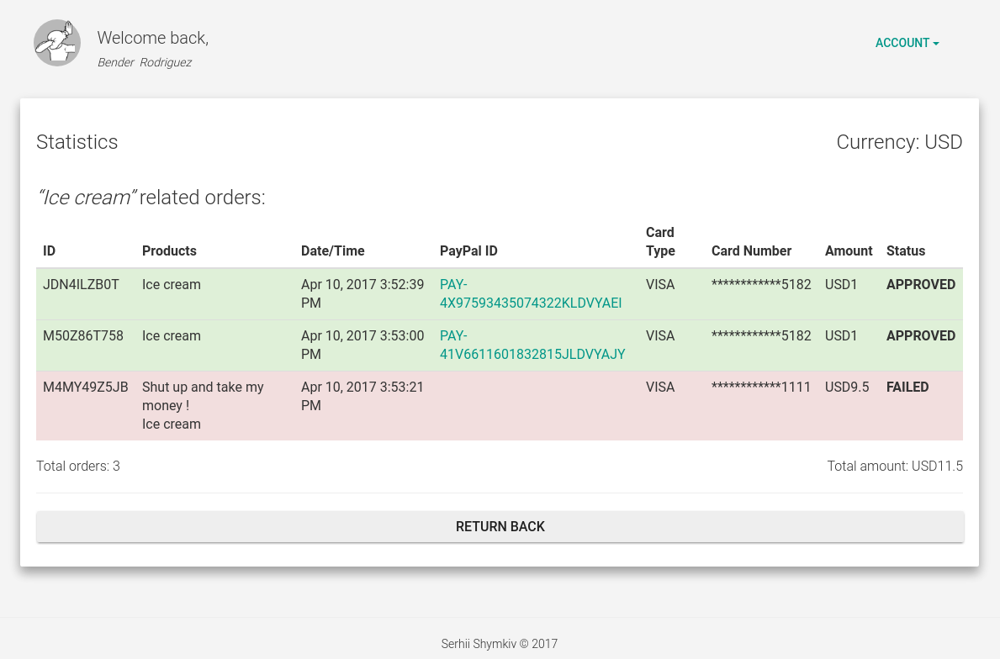

# README #
 

### What is this repository for ? ###

* Quick summary
    * PayPal integration WebApp
* Version
    * 1.0.0-SNAPSHOT

### How do I get set up ? ###

_General steps:_

* You will need:
    * ``JDK v.7+``
    * ``MySQL Server v.5+``
    *  ``Apache Maven v.3+``
    * ``WildFly AS v.10+``
* Force SSL connection if required:
    * paypalm-web/src/main/webapp/WEB-INF/shiro.ini
        * ``ssl.enabled = true``
        * ``...ssl[8443]...``
* Create your own ``localconf/config.properties`` file and override the default properties
    * An example can be found here: ``paypalm-resources/src/main/resources/localconf/config.properties.template``
* Update logging properties:
    * ``paypalm-resources/src/main/resources/logback.properties``
        * ``file.appender.file.path``
* Start the ``WildFly AS``
* Compile, build artifacts and deploy the application:
    * ``mvn clean install -P schema,driver,data-source``
        * Where:
            * ``schema`` profile will drop and create the required DB schema
            * ``driver`` profile will deploy the ``MySQL`` driver (named ``paypalm-mysql-driver``) to the ``WildFly AS``
            * ``data-source`` profile will create the ``paypalmDS`` data-source
        * Note: _in most cases you will need to use described profiles only once: during the very first ``mvn install`` phase execution_
    * ``mvn wildfly:deploy``
* Navigate to ``http://localhost:8080/paypalm``
    * Default user credentials:``demo`` / ``demo``
* Update ``PayPal`` user settings

_Optional steps:_

* Undeploy the application:
    * ``mvn wildfly:undeploy``
* Stop the ``WildFly AS``
    
### What will be good to have ? ###

* WebApp framework utilization (like Spring)
* Better errors handling implementation
* Better ``ShoppingCart`` implementation
* More AJAX and less pages reloads
* Better DB schema structure
    * Better DB normalization
    * More entities (like cards, currencies, countries, etc.)
    * JPA entities lazy initialization (e.g. by utilizing the ``JOIN FETCH`` query)
* Full compliance with the PCI DSS
* Automated tests (like Arquillian in-container tests)
* PayPal simulator (to use it during development)
* Admin subsystem to manage different application settings
* More user settings management (password restoring, account (password, email), currency, card types, etc.)
* Other:
    * ``min JDK7`` was the requirement but it will be great to switch to JDK8
        * Streams, Lambdas, Method references utilization

### Troubleshooting ###

* In case if ``mvn clean install ... -P data-source ...`` command will cause any issues then please:
    * Execute this command: ``mvn wildfly:shutdown`` (it will ``reload`` the ``WildFly AS``)
    * And then repeat the ``mvn clean install ... -P data-source ...`` command
    * (it seems that ``wildfly-maven-plugin`` has issues with the ``<force>true</force>`` option) 

### Notes ###

* Please be aware that PayPal's "sandbox" is not stable at the moment (April 9, 2017), thus you can fall into "timed out" issues.

### Who do I talk to ? ###

[Serhii Shymkiv](mailto:sergey@shimkiv.com)